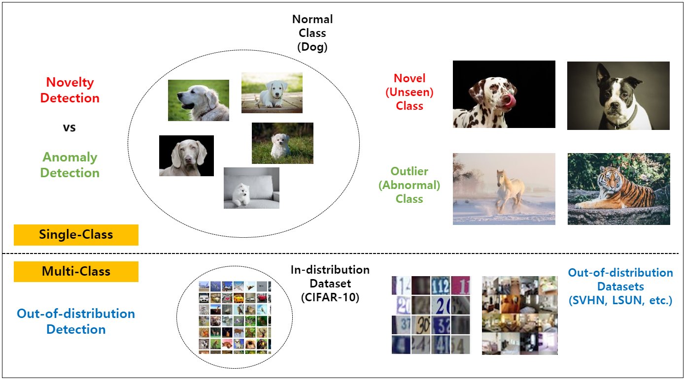

# Awesome-OOD-detection
SOTA work about out-of-distribution (OOD) detection

Anomaly detection is a technique used to identify unusual patterns that do not conform to expected behavior, called outliers. Typically, this is treated as an unsupervised learning problem where the anomalous samples are not known a priori and it is assumed that the majority of the training dataset consists of “normal” data (here and elsewhere the term “normal” means *not anomalous* and is unrelated to the Gaussian distribution).

In general, Anomaly detection is also called `Novelty Detection` or `Outlier Detection`, `Forgery Detection` and `Out-of-distribution Detection`.   

Each term has slightly different meanings. Mostly, on the assumption that you do not have unusual data, this problem is especially called `One Class Classification`, `One Class Segmentation`.  

  

and `Novelty Detection` and `Outlier Detection` have slightly different meanings. Figure below shows the differences of two terms.

Also, typically there are three types of target data. (`time-series data`, and `image data`, `video data`)  
In time-series data, it is aimed to detect a abnormal sections.
In image, video data, it is aimed to classify abnormal images or to segment abnormal regions, for example, defect in some manufacturing data.  

In this Git repo, we mainly focus on the OOD detection

### Out-of-Distribution(OOD) Detection target
- A Baseline for Detecting Misclassified and Out-of-Distribution Examples in Neural Networks  | **[ICLR' 17]** | [`[pdf]`](https://arxiv.org/pdf/1610.02136.pdf)

 The first paper uses softmax score function and build a baseline for OOD detection on benchmark image dataset 

- [**ODIN**] Enhancing The Reliability of Out-of-distribution Image Detection in Neural Networks  | **[ICLR' 18]** | [`[pdf]`](https://arxiv.org/pdf/1706.02690.pdf)
- Training Confidence-calibrated Classifiers for Detecting Out-of-Distribution Samples | **[ICLR' 18]** |  [`[pdf]`](https://arxiv.org/pdf/1711.09325.pdf)
- Learning Confidence for Out-of-Distribution Detection in Neural Networks | **[arXiv' 18]** |  [`[pdf]`](https://arxiv.org/pdf/1802.04865.pdf)
- Out-of-Distribution Detection using Multiple Semantic Label Representations | **[NIPS' 18]** |  [`[pdf]`](http://papers.nips.cc/paper/7967-out-of-distribution-detection-using-multiple-semantic-label-representations.pdf)
- A Simple Unified Framework for Detecting Out-of-Distribution Samples and Adversarial Attacks  | **[NIPS' 18]** |  [`[pdf]`](http://papers.nips.cc/paper/7947-a-simple-unified-framework-for-detecting-out-of-distribution-samples-and-adversarial-attacks.pdf)
- Deep Anomaly Detection with Outlier Exposure  | **[ICLR' 19]** |  [`[pdf]`](https://openreview.net/pdf?id=HyxCxhRcY7)
- Why ReLU networks yield high-confidence predictions far away from the training data and how to mitigate the problem  | **[CVPR' 19]** |  [`[pdf]`](https://arxiv.org/pdf/1812.05720.pdf)
- Outlier Exposure with Confidence Control for Out-of-Distribution Detection | **[arXiv' 19]** |  [`[pdf]`](https://arxiv.org/abs/1906.03509v2) [`[code]`](https://github.com/nazim1021/OOD-detection-using-OECC)
- Likelihood Ratios for Out-of-Distribution Detection | **[NeurIPS' 19]** |  [`[pdf]`](https://arxiv.org/pdf/1906.02845.pdf)
- Outlier Detection in Contingency Tables Using Decomposable Graphical Models | **[SJS' 19]** |  [`[pdf]`](https://onlinelibrary.wiley.com/doi/epdf/10.1111/sjos.12407) [`[code]`](https://github.com/mlindsk/molic)
- Input Complexity and Out-of-distribution Detection with Likelihood-based Generative Models | **[ICLR' 20]** |  [`[pdf]`](https://openreview.net/pdf?id=SyxIWpVYvr)
- Soft Labeling Affects Out-of-Distribution Detection of Deep Neural Networks | **[ICML Workshop' 20]** |  [`[pdf]`](https://arxiv.org/abs/2007.03212)
- Generalized ODIN: Detecting Out-of-Distribution Image Without Learning From Out-of-Distribution Data | **[CVPR' 20]** |  [`[pdf]`](https://openaccess.thecvf.com/content_CVPR_2020/papers/Hsu_Generalized_ODIN_Detecting_Out-of-Distribution_Image_Without_Learning_From_Out-of-Distribution_Data_CVPR_2020_paper.pdf)
- A Boundary Based Out-Of-Distribution Classifier for Generalized Zero-Shot Learning | **[ECCV' 20]** |  [`[pdf]`](https://www.ecva.net/papers/eccv_2020/papers_ECCV/papers/123690562.pdf)
- Provable Worst Case Guarantees for the Detection of Out-of-distribution Data | **[NeurIPS' 20]** |  [`[pdf]`](https://arxiv.org/pdf/2007.08473.pdf) | [`[code]`](https://gitlab.com/Bitterwolf/GOOD)
- On the Value of Out-of-Distribution Testing: An Example of Goodhart's Law  | **[NeurIPS' 20]** |  [`[pdf]`](https://arxiv.org/pdf/2005.09241.pdf)
- Likelihood Regret: An Out-of-Distribution Detection Score For Variational Auto-encoder | **[NeurIPS' 20]** |  [`[pdf]`](https://arxiv.org/pdf/2003.02977.pdf)
- OOD-MAML: Meta-Learning for Few-Shot Out-of-Distribution Detection and Classification | **[NeurIPS' 20]**
- Energy-based Out-of-distribution Detection | **[NeurIPS' 20]** |  [`[pdf]`](https://arxiv.org/pdf/2010.03759.pdf)
- Towards Maximizing the Representation Gap between In-Domain & Out-of-Distribution Examples | **[NeurIPS' 20]**
- Why Normalizing Flows Fail to Detect Out-of-Distribution Data | **[NeurIPS' 20]** |  [`[pdf]`](https://arxiv.org/pdf/2006.08545.pdf) | [`[code]`](https://github.com/PolinaKirichenko/flows_ood)
- Understanding Anomaly Detection with Deep Invertible Networks through Hierarchies of Distributions and Features | **[NeurIPS' 20]** |  [`[pdf]`](https://arxiv.org/pdf/2006.10848.pdf)
- Further Analysis of Outlier Detection with Deep Generative Models | **[NeurIPS' 20]**
- CSI: Novelty Detection via Contrastive Learning on Distributionally Shifted Instances | **[NeurIPS' 20]** |  [`[pdf]`](https://arxiv.org/pdf/2007.08176.pdf) | [`[code]`](https://github.com/alinlab/CSI)
- SSD: A Unified Framework for Self-Supervised Outlier Detection | **[ICLR' 21]**  [`[pdf]`](https://openreview.net/forum?id=v5gjXpmR8J) | [`[code]`](https://github.com/inspire-group/SSD)
